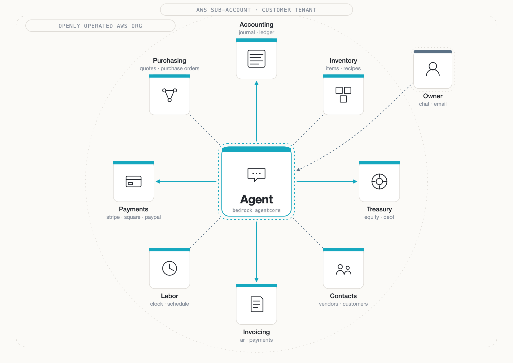
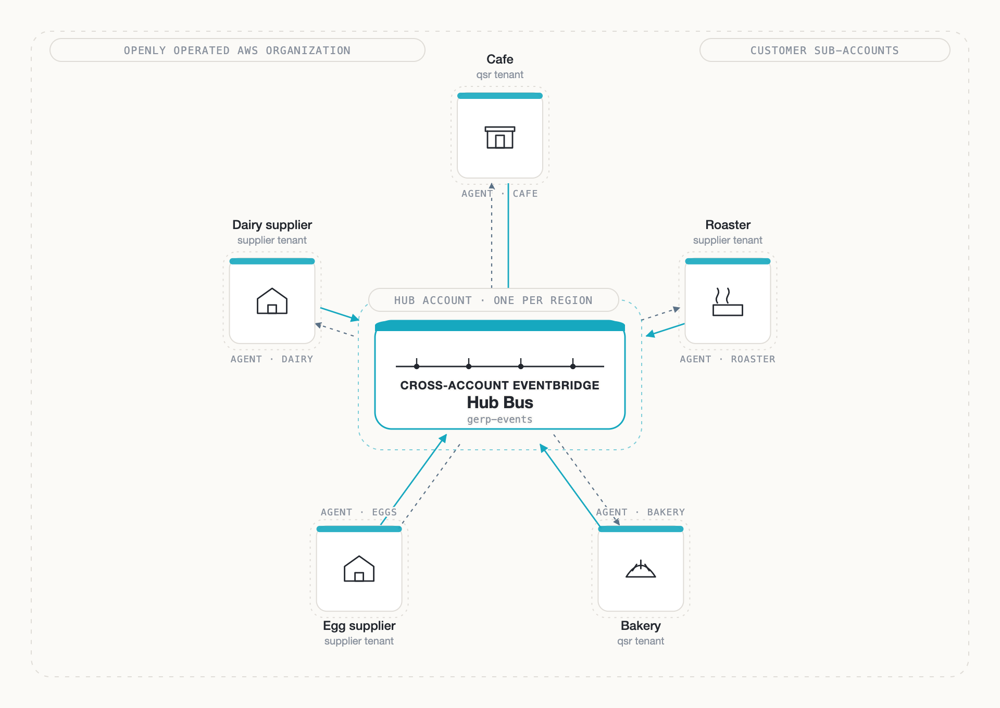
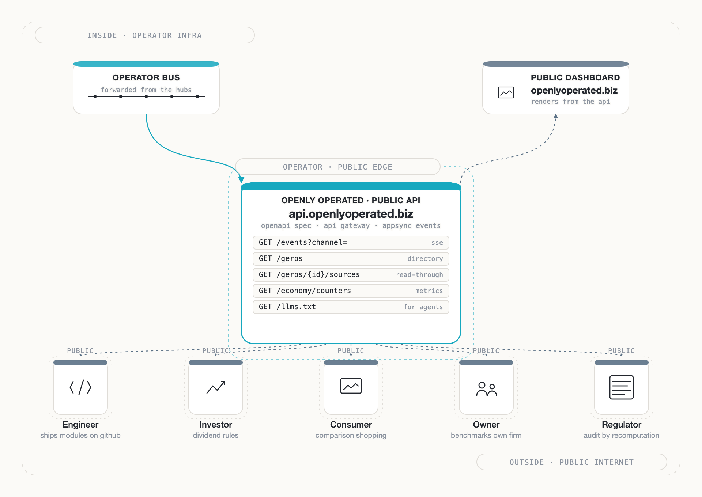

<div align="center">
  <br>
  
  <br><br>
  ERP as the agentic cloud native cross-firm optimization protocol
  <br><br>
  <i>one firm's <code>purchase_request</code> is another's <code>sale</code></i>:
  <br>
  <code>… → sale → inventory → purchase_request → acceptance → shipment → receipt → sale → …</code>
  <br>
</div>

<br>

[](https://discord.gg/87FHhUhQmK)

# gradientERP

one bedrock agent, one set of serverless ERP modules. openly operated by default, and one event bus and api away from all the others to supply the gradient r&d and capital need through business transparency

each business runs its own instance: a gerp, short for ∇ERP

it works as a complete ERP for one business. tell the agent you deposited a check against an invoice and it closes the invoice. when the business on the other side is here too, their purchase request becomes your sale on its own

a single starting user may pay ~$13-31/mo (~$150-370/year)

but as the business scales, a 10-person business typically pays:
- ~$115/mo to intuit.com for accounting
- ~$1,750/mo to salesforce.com for contacts
- ~$119/mo to adp.com for payroll

~$24k/year before add-ons, implementation fees, or seat growth

the same accounting, contacts, payroll, etc workload on gradientERP:
- ~$43-110/mo aws passthrough (lambdas + ddb + bedrock)
- \+ 20% operator margin
- ~$52-132/mo total

~$600-1,600/year. ~15-40x cheaper.

gradientERP enables users to skip the conventional fees and the billion dollar businesses maintaining their human user interfaces

the accounting module is a handful of cheap lambdas and a dynamodb table—the contacts, payroll, purchasing and invoicing modules are similar

and the billion dollar ui c-suite executives depend on is replaced with a bedrock agent

<p align="center"></p>

### invert the firm

> transparency reverses the C[A-Z]O -> ai -> engineer displacement when treated as more **profitable** than [radical](https://en.wiktionary.org/wiki/calypsis)

prices are rising while jobs and investments are disappearing

capital needs a potential to flow

we need a new kind of business

one that **eliminates** rather than survives on impedance

capital follows a gradient. r&d follows a gradient. openly operated business supplies them

when accounting and operational data is published, investors can find and arbitrage returns, engineers can find and arbitrage inefficiency

and consumers can find prices = cost + ε·gradient

a business running in *openly-operated mode* publishes its operations end to end—serving as a rich source of opportunity to create jobs, accelerate investment and lower prices. it's the default for businesses on gradientERP. private individuals running the ERP for personal use leave it off

opening a quick serve restaurant requires a signup on gradienterp.cloud — the operator provisions your sub-account with publicly managed terraform, and you get resources typically requiring months to adopt:

* accounting
* inventory
* purchase order management
* labor scheduling
* point of sale
* supplier and purchasing pipelines
* food safety and compliance logging
* public cost-breakdown dashboards

with openly-operated mode on, these resources ship spec-compliant events to the public stream — engineers and investors consuming live accounting and operational data can see exactly where to invest more labor and capital. with it off, the same modules run, the same agent operates them, but events stay inside the customer's sub-account.

api.openlyoperated.biz supplies the api & dashboard enabling these use cases (all consequences of openly-operated mode at scale, which is why it's a strong default for businesses):

**engineers locate opportunities to invest their labor**
> saw twelve cafes all burning 14% on square fees — shipped a toast migration module, six are running it by friday

**investors locate opportunities to invest their capital**
> this bakery's margin is 31% and the retained earnings curve is steeper than anything else i'm holding — bought into their dividend rule last night

**owners benefit from crowdsourced innovation**
> my agent ran something called a 'terraform command' and now i accept stripe payments

**businesses coordinate or compete**
> the cafe down the street is paying $0.42/oz for beans, we're paying $0.51 — our agent's requoting the roaster in the morning

**consumers locate the most competitive prices**
> three cafes within a mile, the one charging $4.50 is running a 62% margin, the one charging $3.80 is at 38% — i know where i'm going

automating C[A-Z]O work & boardrooms with ai & public dashboards turns firms inside out

theres no reason for engineers to be out of work when theres so much to improve around us—these opportunities just need to be revealed

**standardized productivity reporting** — a gradientERP public profile is built from the books of the businesses a person works with: the shifts they covered, the tasks they closed, the hours each took. every firm records work the same way, so the profile is one performance record across employers, measured in public rather than in an internal performance review. the person publishes only a name, their occupation, where they are and how to reach them. it depends on two consents: the firm is openly operated and the person published a profile. pay, rates and legal documents stay private

### architecture

every gradientERP customer is a single sub-account in the shared AWS organization. a per-tenant Agent — a Bedrock AgentCore deployment configured with the owner's prompt, tool bindings and memory — sits at the center and orchestrates the ERP modules. modules are lambdas; the agent calls them

#### cross firm agentic coordination

each region has a hub: an account holding a cross-account EventBridge bus. every gerp in the region puts its events there, and an event addressed to one gerp goes onto that gerp's hub, which delivers it to the gerp's own bus. a cafe's agent sends `quote.requested` to the roaster; the roaster's bus receives it; POs, journal entries and the public event stream update on both sides. the hub is the thing in the middle — the firms are peers around it

example — no ui, just a chat:

```
cook:  "ken here, getting started"
agent: "got you down for 8:01am. lemme know when you wanna start the prep fridge inventory"
cook:  "oh we're down to 3 cartons of eggs"
agent: "the vendor's agent just said they can drop off a dozen more this afternoon. where you at with your sour cream?"
```

the cook is simultaneously clocking in, measuring inventory, and triggering purchasing across two autonomous businesses. every interaction emits events: `shift.clocked_in`, `stock.moved`, `quote.requested`. the agent posts journal entries (debit inventory, credit ap) in the background

supplier businesses coordinate the same way, openly operated or private: an addressed event is never published. the cafe's agent sends `quote.requested`, the supplier's agent responds with availability and price. the supplier's rule accepts the po, or its owner does when no rule answers, and journal entries post on both sides. each side's entries reach the public stream when that business is openly operated.

<p align="center"></p>

#### public interface

the hubs forward every unaddressed event to the operator bus, which feeds the public edge. api.openlyoperated.biz is the public api, described by an openapi spec: the directory of openly-operated businesses, each one's published sources, the economy counters and the event stream. anything published goes through here; a private business appears only inside the economy-wide counters, never by name. [openlyoperated.biz](https://openlyoperated.biz) renders it. engineers, investors, consumers, owners and regulators all read from the same surface. engineers send modules back as pull requests on github

<p align="center"></p>

### erp coverage

[docs/coverage.md](docs/coverage.md) maps a generic erp feature list to the modules that cover each row; an empty row is open work.

### audit as a diff, not a doctrine

the journal is immutable and append only. balances and statements are materialized into dynamodb for read speed and recomputed from the journal for verification. two paths, same answer

every other accounting system's audit story reduces to "trust our internal controls." an openly-operated customer's audit story reduces to: recompute from the journal, diff against the cache, any divergence is a bug. there is no interpretive layer between the events and the numbers

this is the property a regulator examining a filing wants. it is the property an investor browsing the public feed wants. it is the property an owner wants the first time someone challenges a balance. and it is what makes the public stream meaningful — published numbers that cannot be reconstructed from published events are not numbers, they are claims. private customers get the same property internally; only the *publication* is gated by the openly-operated flag.

### price

aws cost x 1.2. aws passthrough is metered per customer; the platform margin is a 20% markup on top, so the bill scales with what the business actually used rather than a flat fee.

for openly-operated customers the spec forces visible margins, so theres no point charging more than the floor — someone will undercut you and it'll show up in the public ledger

### getting started

**business owners** — sign up at gradienterp.cloud. openly-operated mode is on by default; you can disable it during onboarding if you want to run privately. the operator provisions your sub-account in the shared aws organization, and your agent walks you through onboarding from there (`modules/agent/prompts/bookkeeper.md`)

**private individuals** — same signup, openly-operated toggled off. your agent runs the ERP for your household / sole-prop / personal finances; nothing publishes; you keep the audit-as-a-diff property internally without appearing in the public feed.

**engineer consultants** — business-savvy cloud developers who help entrepreneurs configure, optimize and scale their business on gradientERP

**operator** — runs the public terraform. a gerp created with a card on file at gradienterp.cloud gets a sub-account of the operator's aws organization, vended in the gerp's region, and a codebuild run applies `prod/per_customer` into it (ddb tables, lambdas, bedrock agentcore). cross-account eventbridge enables agent-to-agent coordination across customers — the coordination story is why the operator owns the org rather than customers hosting their own

### contributing

code is a [commodity](https://en.wikipedia.org/wiki/Commodity) now. the platform earns its keep from its design & data. to contribute, request a developer license in an issue comment before cloning. estimate the work in hours and offer a price for non trivial changes. then task an agent with your feature or fix

### funding & compensation

*free contribution* is not sustainable so **invest**

charge as little as possible instead of zero and expect competition when public accounting reveals you charged something else

money that ships dividends through price decreases is **negentropic**
